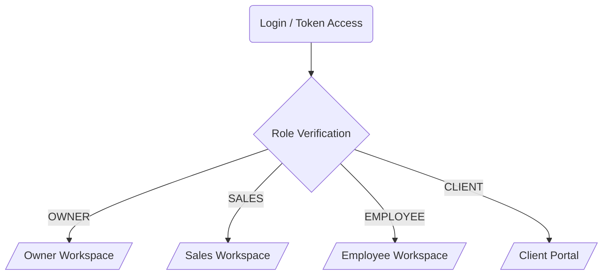
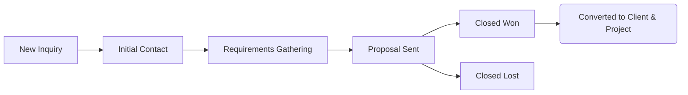
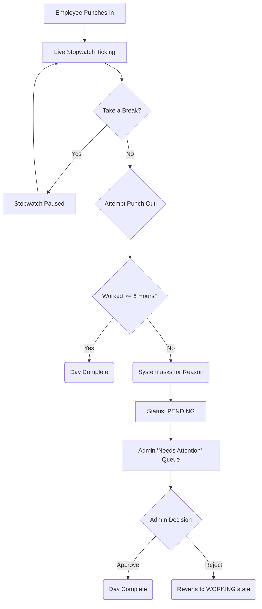

# ESS OS - Comprehensive System Workflow Documentation

ESS OS is a centralized, role-based Business Operating System designed for enterprise management. The system is strictly segmented into four primary workspaces based on user roles: **Owner (Admin)**, **Sales**, **Employee**, and **Client**. 

Below is the end-to-end workflow of every major function within the platform.

---

## 1. Authentication & Role Routing Workflow
When a user accesses the platform, the system immediately dictates their available features based on their assigned role.

---

## 2. Sales & Lead Pipeline Workflow
This module handles the lifecycle of a potential client from initial contact to securing a contract.

1. **Lead Generation**: Sales representatives or Admins create a new Lead (e.g., from an inquiry).
2. **Pipeline Stages**: Leads are moved through a Kanban board:
   - *Cold* -> *Contacted* -> *Negotiation* -> *Proposal Sent* -> *Closed (Won/Lost)*
3. **Follow-ups**: Sales reps log interactions, phone calls, and set reminders for the next contact date.

---

## 3. Project Management Workflow
Once a lead is won, it is converted into an active project.

1. **Project Playbooks**: The Admin selects a "Standardized Project Playbook" (e.g., *E-Commerce Playbook*) which auto-populates the project with predefined Execution Stages.
2. **Task Assignment**: Project tasks are broken down and assigned to specific Employees.
3. **Execution & Kanban**: Employees move their assigned tasks through *To-Do* -> *In Progress* -> *In Review* -> *Done*.
4. **Client Visibility**: Specific high-level milestones are published to the Client Portal, keeping the client informed without exposing internal chatter.

---

## 4. Strict Attendance & Time Tracking Workflow
This is the core workforce management pipeline enforcing strict shift protocols.

1. **Punch In**: An employee clicks "Punch In". The system logs the start time to the database and starts the live stopwatch.
2. **Break Management**: Employees can pause the timer by declaring a break (e.g., Lunch, Tea, Meeting). The system tracks break allowances (e.g., 45m for lunch).
3. **Punch Out Request**:
   - **Scenario A (Standard)**: Employee has worked 8+ hours. The system automatically completes the day and logs the end time.
   - **Scenario B (Early Departure)**: Employee attempts to leave before 8 hours. The system blocks the exit, forces them to enter a "Reason", and sends the request to the Admin Queue.

---

## 5. Finance, Invoicing, and Collections Workflow
Manages the revenue lifecycle tied directly to Project Milestones.

1. **Milestone Creation**: During project creation, financial milestones are set (e.g., 25% Advance, 50% Beta, 25% Launch).
2. **Invoice Generation**: When a milestone is reached, an invoice is generated and sent to the client.
3. **Overdue Tracking**: The system monitors due dates. If an invoice passes the deadline, it triggers an `URGENT` exception.
4. **Needs Attention Queue**: Overdue invoices are automatically pushed to the Owner's dashboard for immediate action (e.g., Send Payment Reminder).

---

## 6. Admin 'Needs Attention' Queue Workflow (Exception Handling)
Instead of forcing the founder/owner to hunt for problems, ESS OS pushes critical operational roadblocks directly to the main dashboard.

1. **Data Aggregation**: The system silently monitors all modules (Finance, Projects, Attendance).
2. **Exception Triggers**:
   - Project task is overdue by X days.
   - Invoice is unpaid.
   - Employee requests an early punch-out.
3. **Direct Resolution**: The Admin can resolve these issues directly from the queue (e.g., clicking *Approve* on an attendance request or *Send Reminder* on an invoice).

---

## 7. Client Portal Workflow
Provides a transparent, secure view for external stakeholders.

1. **Secure Token Access**: Clients are given a unique, secure link (no complex passwords required).
2. **Project Hub**: They can view the overarching progress of their project milestones.
3. **Financials**: Clients can view past receipts, download pending invoices, and see payment schedules.
4. **Updates**: Clients see a sanitized timeline of "Published Updates" pushed by the Admin, keeping them out of the internal employee task Kanban.
